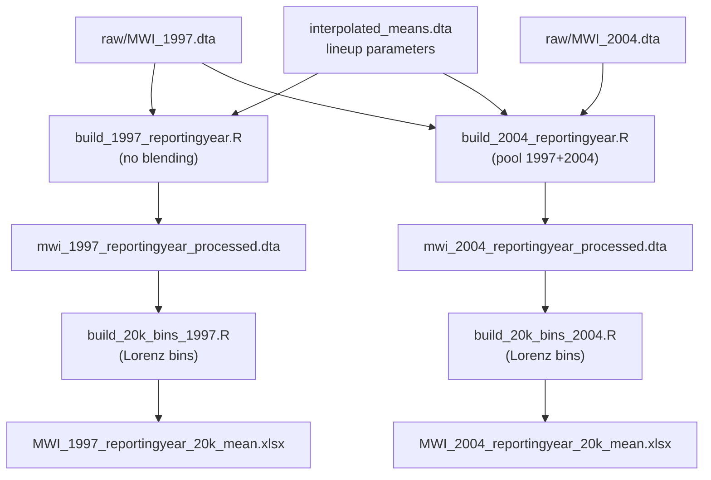
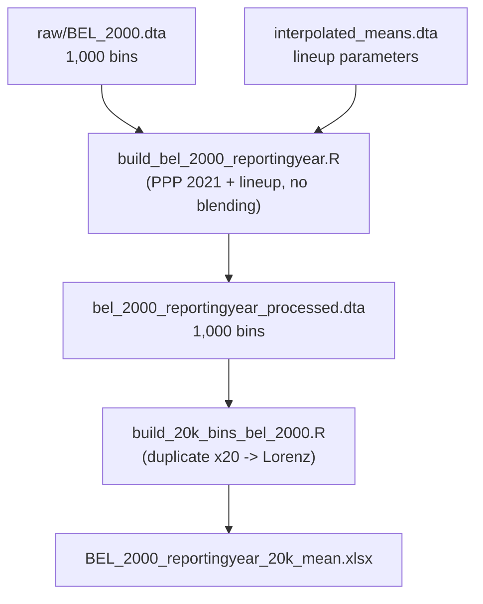

# Correction of the 20,000-bin binning method (MWI 1997 / 2004, BEL 2000)

## 1. The original problem

PIP's code (`get_refy_quantiles()`, in
[`lineup_estimate.R`](https://github.com/PIP-Technical-Team/pip_ingestion_pipeline/blob/806c3e7f/R/lineup_estimate.R#L218-L242))
builds the 20,000 bins like this:

```r
Qx <- fquantile(x$welfare, w = x$weight, probs = probs, names = FALSE)
data.table(welfare = Qx, weight = xpop / nobs, reporting_level = rl)
```

- It takes 20,000 **quantile-function points** (`fquantile`) and uses them
  as if they were the mean of each bin.
- It assigns the same weight `xpop / nobs` to each bin.

This is **not the same** as collapsing the distribution into bins while
preserving the mean. The original mean is:

$$\mu = \frac{\sum_i w_i y_i}{\sum_i w_i}$$

but the mean produced by the quantile method is approximately:

$$\hat\mu = \frac{1}{n}\sum_j Q(p_j)$$

which is a numerical approximation (a Riemann-sum type) to the integral of
the quantile function. With heavy tails, censoring, or extreme values, that
approximation can deviate noticeably from the true mean.

## 2. The solution: Lorenz-curve-based bins

`get_refy_quantiles_mean()` (in
[`build_20k_bins_2004.R`](../02-newmethod/build_20k_bins_2004.R) /
[`build_20k_bins_1997.R`](../02-newmethod/build_20k_bins_1997.R)) builds the
bins differently: it first defines bins of **equal population weight** and
then computes the **actual average welfare within each bin**, using the
generalized Lorenz curve:

1. `p_bounds` — 20,001 equally-spaced probability cutpoints (from 0 to 1).
2. `p_cum` — cumulative population share: `cumsum(weight) / xpop`.
3. `cum_inc` — cumulative **total** welfare (generalized Lorenz curve):
   `cumsum(weight * welfare)`.
4. `approx(p_cum, cum_inc, xout = p_bounds)` — linearly interpolates the
   exact cumulative welfare at each of the 20,000 cutpoints. Linear
   interpolation **splits** observations (households) that straddle two
   bins, the same way `lorenz_table()`/`new_bins` does in the original
   pipeline.
5. `bin_inc <- diff(interpolated_inc)` — total welfare inside each bin.
6. `bin_welfare <- bin_inc / (xpop / nobs)` — the bin's mean = its total
   welfare / its population.

**Why it preserves the mean:** each bin retains its total weight and total
welfare before computing the average, so the weighted mean of the 20,000
bins is mathematically identical to the weighted mean of the original
microdata (not an approximation).

### Current implementation

```r
get_refy_quantiles_mean <- function(df, nobs = 2e4) {

  setorder(df, welfare)
  df_attr <- attributes(df)
  rls <- funique(df$reporting_level)

  # 1. Define the 20,001 exact boundaries of the bins (from 0 to 1)
  p_bounds <- seq(0, 1, length.out = nobs + 1)

  qx <- lapply(rls, \(rl) {
    # Filter out 0-weight rows to avoid breaking the cumulative interpolation
    x <- df[reporting_level == rl & weight > 0]
    xpop <- fsum(x$weight)

    # 2. Calculate cumulative population share (p_cum)
    p_cum <- c(0, cumsum(x$weight) / xpop)
    p_cum[length(p_cum)] <- 1  # guard against floating-point rounding (e.g. 0.999999...)

    # 3. Calculate cumulative total welfare (Generalized Lorenz curve)
    cum_inc <- c(0, cumsum(x$weight * x$welfare))

    # 4. Interpolate the exact cumulative welfare at the 20,000 boundaries
    # Linear interpolation perfectly splits households that overlap two bins
    interpolated_inc <- approx(x = p_cum, y = cum_inc, xout = p_bounds, method = "linear")$y

    # 5. Total welfare inside each bin is the difference between boundaries
    bin_inc <- diff(interpolated_inc)

    # 6. The mean welfare of the bin is its total welfare / its population size
    bin_welfare <- bin_inc / (xpop / nobs)

    data.table(welfare = bin_welfare, weight = xpop / nobs, reporting_level = rl)
  }) |>
    rowbind()

  # Restore attributes
  for (nm in names(df_attr)) {
    if (!nm %in% c("dim", "row.names", "names", "class", ".internal.selfref")) {
      setattr(qx, nm, df_attr[[nm]])
    }
  }

  qx
}
```

Note the `p_cum[length(p_cum)] <- 1` safeguard: without it, floating-point
rounding can leave the last cumulative value as `0.999999...` instead of
exactly `1`, causing `approx()` to return `NA` for the final bin. This was
found when regenerating the MWI 2004 data fully in R and is included in all
three scripts (1997, 2004, BEL 2000).

### Empirical validation

| Dataset | Weighted mean of microdata | Weighted mean of 20,000 bins |
|---|---|---|
| MWI 2004 (`mwi_2004_reportingyear_processed.dta`) | 2.844316 | 2.844316 |
| MWI 1997 (`mwi_1997_reportingyear_processed.dta`) | 5.724018 | 5.724018 |

They match exactly, not just approximately.

## 3. The prerequisite: raw data doesn't work directly

The binning assumes `welfare` is **already in the correct final unit**
(2021 PPP $/day). If the raw survey (nominal local currency) is used, the
binning still preserves the mean — but it preserves the mean of a variable
on the wrong scale:

- `mwi_2004_reportingyear_processed.dta` (already processed) → worked
  directly, reasonable mean (~2.84).
- `MWI_1997.dta` raw → gave an absurd mean (~12,808), because `welfare`
  was still in nominal local currency, without dividing by CPI/ICP/365 or
  adjusting by the lineup factor.

## 4. The "lineup" process: 1997 and 2004 are different

**1997 is its own survey year** (reporting year 1997 == survey year
1997.83). `interpolated_means.dta` has a **single row** for
`year == 1997` (`relative_distance = 1.0`), meaning: **there is no
interpolation or extrapolation between two surveys**. It only goes through
PPP 2021 conversion and its own `mult_factor` (`predicted_mean_ppp/svy_mean`
from that same row).

**2004 does combine two surveys** (1997.83 and 2004.23), because reporting
year 2004 falls "between" both. Each survey is rescaled according to its
`relative_distance` to the reporting year (2004: ≈0.964 for the 2004
survey, ≈0.036 for the 1997 one), and both are pooled into a single
dataset representing reporting year 2004.

This is done by:
- [`build_1997_reportingyear.R`](../01-processing/build_1997_reportingyear.R)
  → uses only `raw/MWI_1997.dta` → generates
  `mwi_1997_reportingyear_processed.dta`.
- [`build_2004_reportingyear.R`](../01-processing/build_2004_reportingyear.R)
  → uses `raw/MWI_1997.dta` + `raw/MWI_2004.dta` → generates
  `mwi_2004_reportingyear_processed.dta`.

Steps (common to both, but with different lineup info):

1. **Lineup parameters**: from `01-input/interpolated_means.dta`, take
   `nac`, `nac_sy`, `relative_distance`, `predicted_mean_ppp`, `svy_mean`,
   `reporting_pop` for the corresponding reporting year.
2. **Conversion to PPP/day**: `welfare_ppp = welfare / (cpi2021 * icp2021 * 365)`.
3. **Lineup factor**: `mult_factor = predicted_mean_ppp / svy_mean` —
   rescales each survey so its mean matches the interpolated mean for the
   reference year.
4. **Population weight rescaling**:
   `weight = weight * (reporting_pop / svy_pop) * relative_distance`.
5. **Applying the factor**: `welfare = welfare_ppp * mult_factor`.
6. **Bottom coding**: `welfare = 0.28` if `welfare < 0.28`.

## 5. Full end-to-end pipeline



## 6. Process files

| File | Role |
|---|---|
| [`build_1997_reportingyear.R`](../01-processing/build_1997_reportingyear.R) | Processes only the 1997 survey (reporting year 1997, no blending). Generates `mwi_1997_reportingyear_processed.dta`. |
| [`build_2004_reportingyear.R`](../01-processing/build_2004_reportingyear.R) | Combines (pools) the 1997 + 2004 surveys for reporting year 2004. Generates `mwi_2004_reportingyear_processed.dta`. |
| [`build_20k_bins_1997.R`](../02-newmethod/build_20k_bins_1997.R) | Lorenz-curve-based binning method for reporting year 1997. |
| [`build_20k_bins_2004.R`](../02-newmethod/build_20k_bins_2004.R) | Lorenz-curve-based binning method for reporting year 2004. |
| `01-processing/raw/MWI_1997.dta`, `MWI_2004.dta` | Raw input microdata. |
| `01-processing/mwi_1997_reportingyear_processed.dta` | Processed data, reporting year 1997 (no blending). |
| `01-processing/mwi_2004_reportingyear_processed.dta` | Processed data, reporting year 2004 (pool of 1997+2004). |
| `03-outputs/MWI_1997_reportingyear_20k_mean.xlsx` / `MWI_2004_reportingyear_20k_mean.xlsx` | Final results: 20,000 bins with the mean preserved. |

## 7. Conclusion

- The binning method (`get_refy_quantiles_mean`) is correct and preserves
  the mean exactly, unlike the point-quantile method (`fquantile`), which
  only approximates it.
- But that method **requires `welfare` to already be in its final unit**
  ($ PPP/day, adjusted by lineup). If given the raw survey without that
  prior processing, the binning still "works" (it doesn't error out) but
  produces a mean on the wrong scale.
- 1997 and 2004 require different processing: 1997 (its own survey year)
  only needs PPP/day + its own `mult_factor`; 2004 additionally needs the
  pooling and rescaling of two surveys.
- The correct order is: **1)** process the raw survey with the lineup
  logic corresponding to the reporting year, **2)** apply the Lorenz-based
  binning on that already-processed data.

## 8. Special case: BEL 2000 (raw data already comes as 1,000 bins)

Unlike MWI (individual microdata, one record per household/person),
`raw/BEL_2000.dta` **already comes pre-aggregated into 1,000** population
bins (one row per bin, each with its average `welfare` and the same
`weight`). This changes the process in two ways:

**a) Its own reporting year, no blending.** Just like MWI 1997,
`interpolated_means.dta` has a single row for
`country_code == "BEL" & year == 2000` (`relative_distance = 1.0`,
`predicted_mean_ppp == svy_mean`, so `mult_factor = 1`). It only goes
through PPP 2021 conversion, weight rescaling to `reporting_pop`, and
bottom coding — no interpolation/extrapolation between two surveys.

**b) Going from 1,000 to 20,000 bins by duplication, not microdata.** Since
there is no information about the distribution *within* each of the 1,000
bins (only their average), the Lorenz-curve interpolation can't be applied
directly over just 1,000 points without distorting the original structure.
Instead, each of the 1,000 bins is **duplicated 20 times** (same `welfare`,
`weight` split into 20 equal parts), generating 20,000 rows of pseudo-
microdata that preserve exactly the mean and the shape of the distribution
(same Lorenz curve, just at a finer resolution). The same
`get_refy_quantiles_mean()` function used for MWI is then run on that
pseudo-microdata, for consistency of method.

### Empirical validation (BEL 2000)

| Stage | Rows | Weighted mean |
|---|---|---|
| Processed 1,000 bins (`bel_2000_reportingyear_processed.dta`) | 1,000 | 63.42967 |
| Expanded pseudo-microdata (x20) | 20,000 | 63.42967 |
| Final 20,000 bins (`BEL_2000_reportingyear_20k_mean.xlsx`) | 20,000 | 63.42967 |

The mean is preserved exactly at every stage.

### BEL 2000 pipeline



### BEL 2000 process files

| File | Role |
|---|---|
| [`build_bel_2000_reportingyear.R`](../01-processing/build_bel_2000_reportingyear.R) | PPP 2021 + lineup (no blending) on the raw 1,000 bins. Generates `bel_2000_reportingyear_processed.dta`. |
| [`build_20k_bins_bel_2000.R`](../02-newmethod/build_20k_bins_bel_2000.R) | Duplicates each bin 20x (1,000 → 20,000 rows) and applies the Lorenz-based binning method. |
| `01-processing/raw/BEL_2000.dta` | Raw data: 1,000 population bins (not individual microdata). |
| `01-processing/bel_2000_reportingyear_processed.dta` | 1,000 bins already in 2021 PPP/day. |
| `03-outputs/BEL_2000_reportingyear_20k_mean.xlsx` | Final result: 20,000 bins with the mean preserved. |
