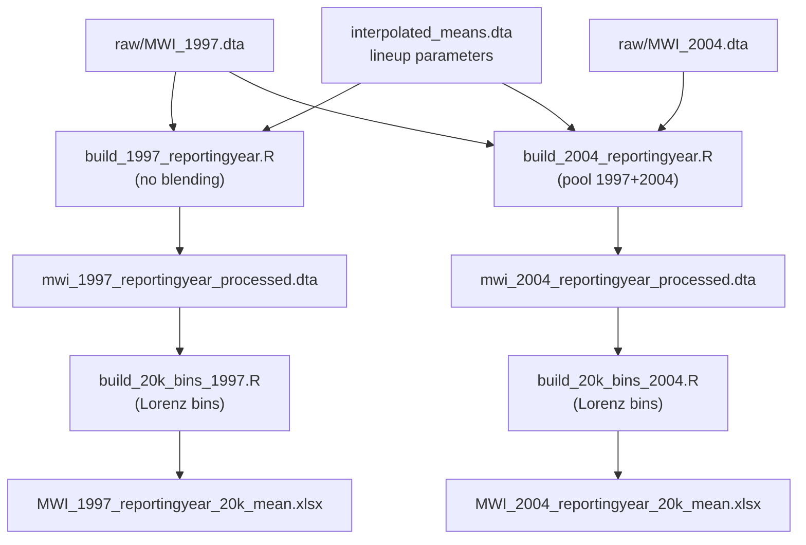
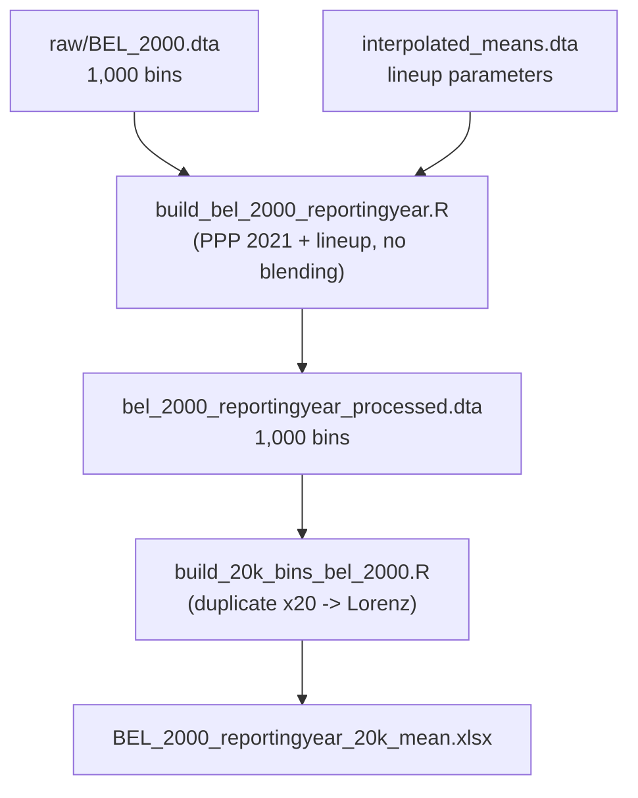

# Correction of the 20,000-bin binning method (MWI 1997 / 2004, BEL 2000)

## Executive summary

The original 20,000-bin binning method used `fquantile()`, which represented each bin by a **single point read off the quantile function** (the income at the bin's midpoint percentile) instead of the **actual average income inside the bin**. These two things are not the same when the distribution has heavy tails, censoring, or extreme values, so the method introduces a bias that compounds through every downstream poverty calculation. With 20,000 bins the bias is small but real; it is most pronounced in the tails, where a single quantile point fails to capture the average of the incomes around it.

The correction replaces this with a **generalized-Lorenz-curve** approach: it defines bins of equal population weight and then computes the **actual average welfare within each bin**. This guarantees that the weighted mean of the 20,000 bins matches the mean of the original microdata **exactly** (mathematically proven), not just approximately. This has been validated empirically on MWI 1997, MWI 2004, and BEL 2000, where the means match to machine rounding precision.

Two conditions must be respected. First, the binning requires `welfare` to already be in its final unit (2021 PPP $/day, adjusted by lineup); run on raw data it still "works" but preserves a mean on the wrong scale. Second, each reporting year needs its own processing: 1997 (its own survey year, no blending), 2004 (a pool of the 1997 and 2004 surveys), and BEL 2000 (which arrives pre-aggregated into 1,000 bins and is expanded ×20).

## 1. The original problem

PIP's code (`get_refy_quantiles()`, in
[`lineup_estimate.R`](https://github.com/PIP-Technical-Team/pip_ingestion_pipeline/blob/806c3e7f/R/lineup_estimate.R#L218-L242))
builds the 20,000 bins like this:

```r
Qx <- fquantile(x$welfare, w = x$weight, probs = probs, names = FALSE)
data.table(welfare = Qx, weight = xpop / nobs, reporting_level = rl)
```

- It takes 20,000 **quantile-function points** (`fquantile`) and uses them
  as if they were the mean of each bin.
- It assigns the same weight `xpop / nobs` to each bin.

The probabilities used are **not** the bin boundaries but the **midpoint of each bin**:

```r
probs <- seq(1, nobs, 1) / nobs - 5 / (nobs * 10)
# e.g. for nobs = 4: 0.125, 0.375, 0.625, 0.875
```

So the method reads the income value sitting at the *center* of each population
slice and uses that single point as if it were the bin's average.

This is **not the same** as collapsing the distribution into bins while
preserving the mean. The true (weighted) mean of the microdata is the sum of
weighted welfare divided by total weight:

$$\mu = \frac{\sum_i w_i \, y_i}{\sum_i w_i}$$

But the mean produced by the quantile method is the simple average of the
quantile-function values at the bin midpoints:

$$\hat{\mu} = \frac{1}{n}\sum_{j} Q(p_j)$$

A single point on the quantile function ("what does the person standing at
this position of the ranking earn?") is not the same as the average of a
whole slice ("what do all the people in this slice earn on average?"). With
heavy tails, censoring, or extreme values, the two diverge — and the
quantile method never fully sees the very top of the distribution, because
its highest evaluation point is a midpoint percentile, not 100%.

## 2. The solution: Lorenz-curve-based bins

`get_refy_quantiles_mean()` (in
[`build_20k_bins_2004.R`](../02-newmethod/build_20k_bins_2004.R) /
[`build_20k_bins_1997.R`](../02-newmethod/build_20k_bins_1997.R) / [`build_20k_bins_1997_findInterval.R`](../02-newmethod/build_20k_bins_1997_findInterval.R)) builds the
bins differently: it first defines bins of **equal population weight** and
then computes the **actual average welfare within each bin**, using the
generalized Lorenz curve:

1. `p_bounds` — 20,001 equally-spaced probability cutpoints (from 0 to 1).
2. `p_cum` — cumulative population share: `cumsum(weight) / xpop`.
3. `cum_inc` — cumulative **total** welfare (generalized Lorenz curve):
   `cumsum(weight * welfare)`.
4. **Linear interpolation** — linearly interpolates the exact cumulative welfare at each of the 20,000 cutpoints. Linear interpolation **splits** observations (households) that straddle two bins, the same way `lorenz_table()`/`new_bins` does in the original pipeline. (This step can be done either via base R's `approx()` or via an optimized `findInterval()` variant with identical results and better computational efficiency — see [Section 10](#10-performance-optimization-findinterval-vs-approx).)
5. `bin_inc <- diff(interpolated_inc)` — total welfare inside each bin.
6. `bin_welfare <- bin_inc / (xpop / nobs)` — the bin's mean = its total
   welfare / its population.

**Why it preserves the mean:** each bin retains its total weight and total
welfare before computing the average, so the weighted mean of the 20,000
bins is mathematically identical to the weighted mean of the original
microdata (not an approximation).

### Implementation

```r
get_refy_quantiles_mean <- function(df, nobs = 2e4) {

  setorder(df, welfare)
  df_attr <- attributes(df)
  rls <- funique(df$reporting_level)

  # 1. Define the 20,001 exact boundaries of the bins (from 0 to 1)
  p_bounds <- seq(0, 1, length.out = nobs + 1)

  qx <- lapply(rls, \(rl) {
    # Filter out 0-weight rows to avoid breaking the cumulative interpolation
    x <- df[reporting_level == rl & weight > 0]
    xpop <- fsum(x$weight)

    # 2. Calculate cumulative population share (p_cum)
    p_cum <- c(0, fcumsum(x$weight) / xpop)
    p_cum[length(p_cum)] <- 1  # guard against floating-point rounding (e.g. 0.999999...)

    # 3. Calculate cumulative total welfare (Generalized Lorenz curve)
    cum_inc <- c(0, fcumsum(x$weight * x$welfare))

    # 4. Interpolate the exact cumulative welfare at the 20,000 boundaries
    # Linear interpolation perfectly splits households that overlap two bins
    interpolated_inc <- approx(x = p_cum, y = cum_inc, xout = p_bounds, method = "linear")$y

    # 5. Total welfare inside each bin is the difference between boundaries
    bin_inc <- diff(interpolated_inc)

    # 6. The mean welfare of the bin is its total welfare / its population size
    bin_welfare <- bin_inc / (xpop / nobs)

    data.table(welfare = bin_welfare, weight = xpop / nobs, reporting_level = rl)
  }) |>
    rowbind()

  # Restore attributes
  for (nm in names(df_attr)) {
    if (!nm %in% c("dim", "row.names", "names", "class", ".internal.selfref")) {
      setattr(qx, nm, df_attr[[nm]])
    }
  }

  qx
}
```

Note the `p_cum[length(p_cum)] <- 1` safeguard: without it, floating-point
rounding can leave the last cumulative value as `0.999999...` instead of
exactly `1`, causing `approx()` to return `NA` for the final bin. This was
found when regenerating the MWI 2004 data fully in R and is included in all
three scripts (1997, 2004, BEL 2000).

**Performance note:** The code uses `fcumsum()` (from the `fastverse` package)
instead of base R's `cumsum()`. This is a simple optimization that performs
cumulative sums more efficiently on large vectors.
All three scripts (`build_20k_bins_1997.R`, `build_20k_bins_2004.R`,
`build_20k_bins_bel_2000.R`) use `fcumsum()` for this reason.

An alternative interpolation variant (using `findInterval()`
instead of `approx()`, with identical results) is documented in
[Section 10](#10-performance-optimization-findinterval-vs-approx).

## 3. Worked example: why the old method fails and the new one succeeds

Consider 10 households, each with weight 1, sorted from poorest to richest:

```
Household:  1    2    3    4    5    6    7    8    9    10
Income:     10   15   20   25   30   35   40   45   50   200   ← billionaire!

TRUE AVERAGE = (10+15+20+25+30+35+40+45+50+200) / 10 = 47
```

We want to collapse this into 4 bins of equal population (2.5 people each)
and preserve the mean of 47. (Four bins is used only to make the arithmetic
visible; the real method uses 20,000 — see the note at the end.)

**Old method (`fquantile` at bin midpoints)**

The code evaluates the quantile function at the **midpoint** of each bin
(percentiles 12.5, 37.5, 62.5, 87.5), then uses that single income value as
the bin's mean.

To read an income at a given percentile, order the 10 people along a 0%–100%
ruler: the first person sits at 0%, the last at 100%, and the rest are spread
evenly (one person every 100/9 ≈ 11.11%). The income at a percentile that
falls between two people is linearly interpolated:

```
Bin 1 (poorest 25%) → pct 12.5 → between person 2 (15) and 3 (20) → 15.625
Bin 2               → pct 37.5 → between person 4 (25) and 5 (30) → 26.875
Bin 3               → pct 62.5 → between person 6 (35) and 7 (40) → 38.125
Bin 4 (richest 25%) → pct 87.5 → between person 8 (45) and 9 (50) → 49.375
                                                       ↑ the 200 is never seen!

Average of bins = (15.625 + 26.875 + 38.125 + 49.375) / 4 = 32.5   ← WRONG (true = 47)
```

**❌ ERROR:** The bin average is **32.5** but the true average is **47**.

Why? The highest point the method ever evaluates is percentile 87.5, which
falls between persons 8 and 9 (incomes 45 and 50). The billionaire (income
200) sits at the 100% mark, far beyond 87.5%, so it **never enters the
calculation**. `fquantile` returns a **single point on the distribution
curve**, not the **actual average income within each population slice**.

---

**New method (Lorenz curve)**

Instead of reading one point, sum **all** the income inside each population
slice and divide by its people.

Step 1: Cumulative population and cumulative income (the generalized Lorenz curve)
```
Cumulative population share: [0,  0.25,  0.50,  0.75,  1.00]
Cumulative income:           [0,   25,   105,   210,   470]
```
(Total income is 470 → 470/10 = 47 average, as expected.)

Step 2: Income **within** each bin (difference between boundaries)
```
Bin 1:  25 - 0   = 25
Bin 2: 105 - 25  = 80
Bin 3: 210 - 105 = 105
Bin 4: 470 - 210 = 260   ← the 200 IS included here
```

Step 3: Mean of each bin (bin income / its 2.5 people)
```
Bin 1:  25 / 2.5 = 10
Bin 2:  80 / 2.5 = 32
Bin 3: 105 / 2.5 = 42
Bin 4: 260 / 2.5 = 104

Average of bins = (10 + 32 + 42 + 104) / 4 = 47  ← CORRECT!
```

**✅ CORRECT:** The bin average is exactly **47**.

### Side-by-side

| Column_1 | Bin 1 | Bin 2 | Bin 3 | Bin 4 | Average |
|---|---|---|---|---|---|
| **Old** (quantile point) | 15.625 | 26.875 | 38.125 | 49.375 | **32.5** ✗ |
| **New** (Lorenz average) | 10 | 32 | 42 | 104 | **47** ✓ |
| True mean | | | | | 47 |

The entire gap comes from Bin 4: the old method values the richest slice at
49.375 (a point near person 9), while its true average is 104 because it
actually contains the billionaire.

### Why this matters with 20,000 bins

With only 4 bins the error looks huge (32.5 vs 47) because the highest
midpoint evaluated is percentile 87.5, missing the entire top tail. With
**20,000 bins**, the highest midpoint is percentile 99.9975%, so nearly all
of the tail *is* captured and the bias becomes **much smaller and subtler**
— but it does not vanish. It persists wherever the distribution is uneven
within a bin (i.e. in the tails), and it accumulates across 200+ countries ×
30+ years.

With the new Lorenz-curve-based method:
- Each bin contains a **known portion of the population** (population share)
- The **actual average income** within that portion is computed exactly
- The weighted mean of the 20,000 bins is **guaranteed to match** the true population mean (mathematically proven)

## 4. Empirical validation

| Dataset | Weighted mean of microdata | Weighted mean of 20,000 bins |
|---|---|---|
| MWI 2004 (`mwi_2004_reportingyear_processed.dta`) | 2.844316 | 2.844316 |
| MWI 1997 (`mwi_1997_reportingyear_processed.dta`) | 5.724018 | 5.724018 |

They match exactly, not just approximately.

## 5. The prerequisite: raw data doesn't work directly

The binning assumes `welfare` is **already in the correct final unit**
(2021 PPP $/day). If the raw survey (nominal local currency) is used, the
binning still preserves the mean — but it preserves the mean of a variable
on the wrong scale.

## 6. The "lineup" process: 1997 and 2004 are different

**1997 is its own survey year** (reporting year 1997 == survey year
1997.83). `interpolated_means.dta` has a **single row** for
`year == 1997` (`relative_distance = 1.0`), meaning: **there is no
interpolation or extrapolation between two surveys**. It only goes through
PPP 2021 conversion and its own `mult_factor` (`predicted_mean_ppp/svy_mean`
from that same row).

**2004 does combine two surveys** (1997.83 and 2004.23), because reporting
year 2004 falls "between" both. Each survey is rescaled according to its
`relative_distance` to the reporting year (2004: ≈0.964 for the 2004
survey, ≈0.036 for the 1997 one), and both are pooled into a single
dataset representing reporting year 2004.

This is done by:
- [`build_1997_reportingyear.R`](../01-processing/build_1997_reportingyear.R)
  → uses only `raw/MWI_1997.dta` → generates
  `mwi_1997_reportingyear_processed.dta`.
- [`build_2004_reportingyear.R`](../01-processing/build_2004_reportingyear.R)
  → uses `raw/MWI_1997.dta` + `raw/MWI_2004.dta` → generates
  `mwi_2004_reportingyear_processed.dta`.

Steps (common to both, but with different lineup info):

1. **Lineup parameters**: from `01-input/interpolated_means.dta`, take
   `nac`, `nac_sy`, `relative_distance`, `predicted_mean_ppp`, `svy_mean`,
   `reporting_pop` for the corresponding reporting year.
2. **Conversion to PPP/day**: `welfare_ppp = welfare / (cpi2021 * icp2021 * 365)`.
3. **Lineup factor**: `mult_factor = predicted_mean_ppp / svy_mean` —
   rescales each survey so its mean matches the interpolated mean for the
   reference year.
4. **Population weight rescaling**:
   `weight = weight * (reporting_pop / svy_pop) * relative_distance`.
5. **Applying the factor**: `welfare = welfare_ppp * mult_factor`.
6. **Bottom coding**: `welfare = 0.28` if `welfare < 0.28`.

## 7. Full end-to-end pipeline



### Process files

| File | Role |
|---|---|
| [`build_1997_reportingyear.R`](../01-processing/build_1997_reportingyear.R) | Processes only the 1997 survey (reporting year 1997, no blending). Generates `mwi_1997_reportingyear_processed.dta`. |
| [`build_2004_reportingyear.R`](../01-processing/build_2004_reportingyear.R) | Combines (pools) the 1997 + 2004 surveys for reporting year 2004. Generates `mwi_2004_reportingyear_processed.dta`. |
| [`build_20k_bins_1997.R`](../02-newmethod/build_20k_bins_1997.R) | Lorenz-curve-based binning method for reporting year 1997 (uses `approx()`). |
| [`build_20k_bins_1997_findInterval.R`](../02-newmethod/build_20k_bins_1997_findInterval.R) | **Optimized version**: Lorenz-curve-based binning for 1997 using `findInterval()` (more efficient, identical results). |
| [`build_20k_bins_2004.R`](../02-newmethod/build_20k_bins_2004.R) | Lorenz-curve-based binning method for reporting year 2004 (uses `approx()`). |
| [`build_20k_bins_bel_2000.R`](../02-newmethod/build_20k_bins_bel_2000.R) | Lorenz-curve-based binning for BEL 2000 (uses `approx()`). |
| `01-processing/raw/MWI_1997.dta`, `MWI_2004.dta` | Raw input microdata. |
| `01-processing/mwi_1997_reportingyear_processed.dta` | Processed data, reporting year 1997 (no blending). |
| `01-processing/mwi_2004_reportingyear_processed.dta` | Processed data, reporting year 2004 (pool of 1997+2004). |
| `03-outputs/MWI_1997_reportingyear_20k_mean.xlsx` / `MWI_2004_reportingyear_20k_mean.xlsx` | Final results: 20,000 bins with the mean preserved. |

## 8. Special case: BEL 2000 (raw data already comes as 1,000 bins)

Unlike MWI (individual microdata, one record per household/person),
`raw/BEL_2000.dta` **already comes pre-aggregated into 1,000** population
bins (one row per bin, each with its average `welfare` and the same
`weight`). This changes the process in two ways:

**a) Its own reporting year, no blending.** Just like MWI 1997,
`interpolated_means.dta` has a single row for
`country_code == "BEL" & year == 2000` (`relative_distance = 1.0`,
`predicted_mean_ppp == svy_mean`, so `mult_factor = 1`). It only goes
through PPP 2021 conversion, weight rescaling to `reporting_pop`, and
bottom coding — no interpolation/extrapolation between two surveys.

**b) Going from 1,000 to 20,000 bins by duplication, not microdata.** Since
there is no information about the distribution *within* each of the 1,000
bins (only their average), the Lorenz-curve interpolation can't be applied
directly over just 1,000 points without distorting the original structure.
Instead, each of the 1,000 bins is **duplicated 20 times** (same `welfare`,
`weight` split into 20 equal parts), generating 20,000 rows of pseudo-
microdata that preserve exactly the mean and the shape of the distribution
(same Lorenz curve, just at a finer resolution). The same
`get_refy_quantiles_mean()` function used for MWI is then run on that
pseudo-microdata, for consistency of method.

### Empirical validation (BEL 2000)

| Stage | Rows | Weighted mean |
|---|---|---|
| Processed 1,000 bins (`bel_2000_reportingyear_processed.dta`) | 1,000 | 63.42967 |
| Expanded pseudo-microdata (x20) | 20,000 | 63.42967 |
| Final 20,000 bins (`BEL_2000_reportingyear_20k_mean.xlsx`) | 20,000 | 63.42967 |

The mean is preserved exactly at every stage.

### BEL 2000 pipeline



### BEL 2000 process files

| File | Role |
|---|---|
| [`build_bel_2000_reportingyear.R`](../01-processing/build_bel_2000_reportingyear.R) | PPP 2021 + lineup (no blending) on the raw 1,000 bins. Generates `bel_2000_reportingyear_processed.dta`. |
| [`build_20k_bins_bel_2000.R`](../02-newmethod/build_20k_bins_bel_2000.R) | Duplicates each bin 20x (1,000 → 20,000 rows) and applies the Lorenz-based binning method. |
| `01-processing/raw/BEL_2000.dta` | Raw data: 1,000 population bins (not individual microdata). |
| `01-processing/bel_2000_reportingyear_processed.dta` | 1,000 bins already in 2021 PPP/day. |
| `03-outputs/BEL_2000_reportingyear_20k_mean.xlsx` | Final result: 20,000 bins with the mean preserved. |

## 9. Conclusion

- The binning method (`get_refy_quantiles_mean`) is correct and preserves
  the mean exactly, unlike the point-quantile method (`fquantile`), which
  only approximates it.
- But that method **requires `welfare` to already be in its final unit**
  ($ PPP/day, adjusted by lineup). If given the raw survey without that
  prior processing, the binning still "works" (it doesn't error out) but
  produces a mean on the wrong scale.
- 1997 and 2004 require different processing: 1997 (its own survey year)
  only needs PPP/day + its own `mult_factor`; 2004 additionally needs the
  pooling and rescaling of two surveys.
- The correct order is: **1)** process the raw survey with the lineup
  logic corresponding to the reporting year, **2)** apply the Lorenz-based
  binning on that already-processed data.

## 10. Performance optimization: `findInterval()` vs. `approx()`

The Lorenz-curve binning method requires **linear interpolation** in step 4 of the algorithm. The core function `get_refy_quantiles_mean()` has been implemented in two equivalent ways, differing only in how this interpolation is performed. This is purely a computational optimization — it does not change the results.

### Original implementation: `approx()`

```r
interpolated_inc <- approx(x = p_cum, y = cum_inc, xout = p_bounds, method = "linear")$y
```

This uses base R's generic `approx()` function, which:
- Searches for the correct interval for each of the 20,001 output points
- Performs linear interpolation for each point individually
- Is flexible (works for any interpolation problem) but relatively slow

### Optimized implementation: `findInterval()` + vectorized interpolation

```r
# Helper function: vectorized linear interpolation using findInterval()
lorenz_interp <- function(p_cum, cum_inc, p_bounds) {
  n <- length(p_cum)
  # Find which interval each p_bounds point falls into
  idx <- findInterval(p_bounds, p_cum, rightmost.closed = TRUE)
  # Clamp indices to valid range [1, n-1]
  idx <- pmin(pmax(idx, 1L), n - 1L)

  # Extract the left and right points of each interval
  x0 <- p_cum[idx];   x1 <- p_cum[idx + 1L]
  y0 <- cum_inc[idx]; y1 <- cum_inc[idx + 1L]

  # Linear interpolation: y = y0 + (y1 - y0) * (x - x0) / (x1 - x0)
  y0 + (y1 - y0) * (p_bounds - x0) / (x1 - x0)
}
```

Within `get_refy_quantiles_mean()`, step 4 simply becomes:

```r
interpolated_inc <- lorenz_interp(p_cum, cum_inc, p_bounds)
```

This uses:
- `findInterval()` — an optimized C-level function that finds all intervals in a single vectorized pass
- Manual vectorized linear interpolation applied to all 20,001 points simultaneously
- Specific to this use case (faster) but more transparent

### Accuracy comparison

Both implementations produce **numerically identical results**:

| Dataset | Max difference |
|---|---|
| MWI 1997 | 7.05 × 10⁻¹² |
| MWI 2004 | 0 |
| BEL 2000 | 2.33 × 10⁻¹⁰ |

These are machine rounding errors and completely negligible.

### Efficiency comparison

Benchmarking in this pipeline indicates that the `findInterval()` implementation
is computationally more efficient than `approx()` for the interpolation step,
while preserving numerically identical results.